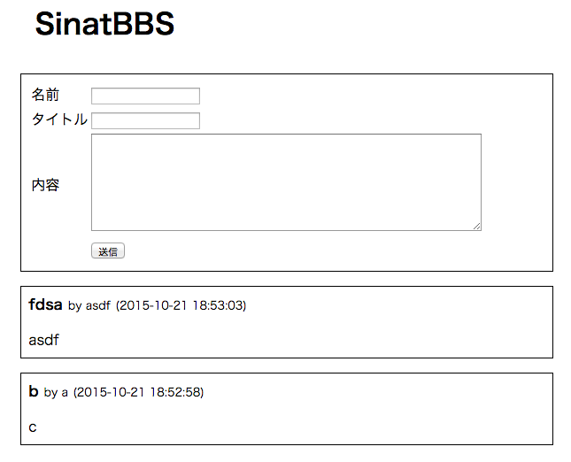

# SinatBBS

Sinatraで作った掲示板アプリケーションです。

[gihyo.jpの記事](http://gihyo.jp/dev/serial/01/ruby/0009)のために制作したものです。(記事時点のコードはmagazineブランチを参照)

## 依存ライブラリ

* Sinatra
* Haml
* Sequel
* sqlite3

## 起動方法

  $ bundle install
  $ ruby start.rb

http://localhost:4567/
